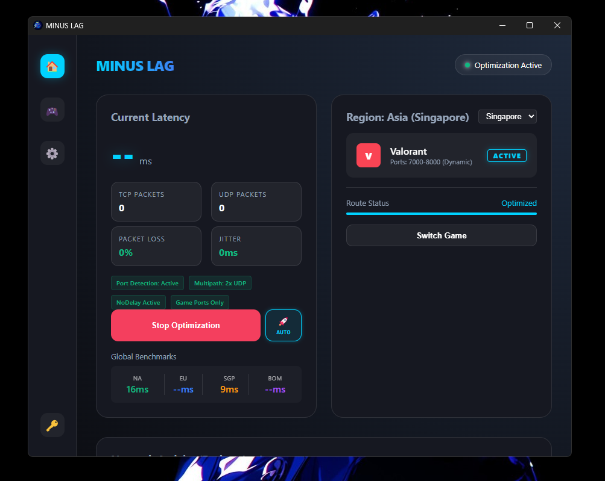
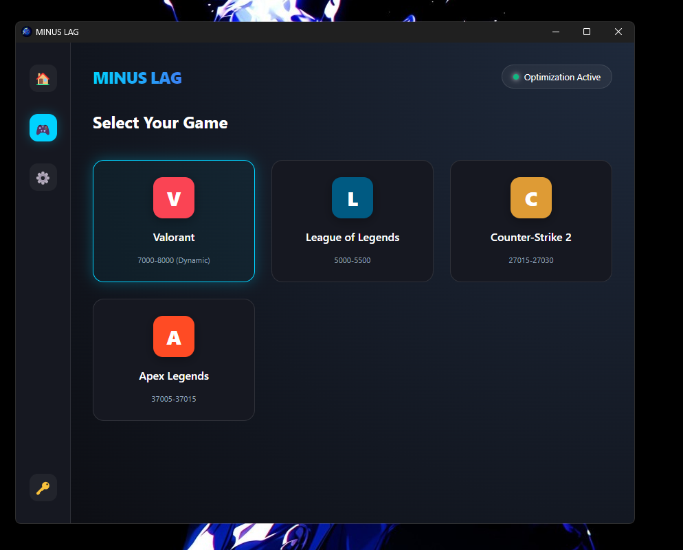
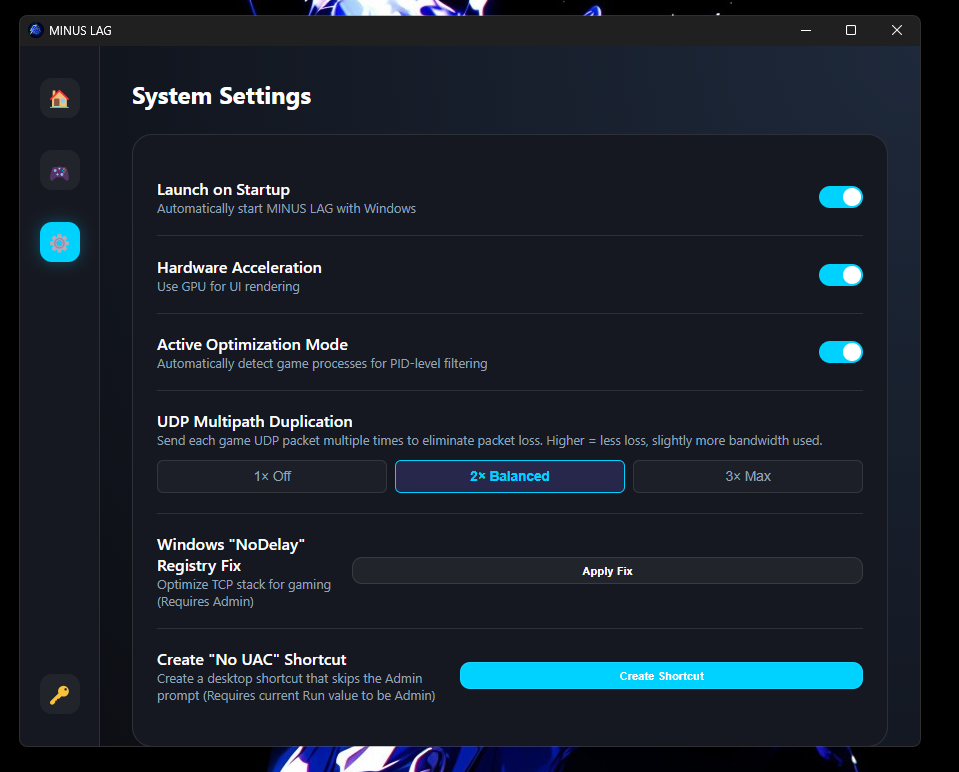

# MINUS LAG

**Minus Lag** is a high-performance network optimization tool designed to stabilize ping, reduce jitter, and eliminate packet loss for competitive gaming.

## 🚀 Key Features

### 1. Unified Dashboard
The command center for your network optimization.
- **Start Optimization**: One-click activation of the packet processing engine.
- **Auto-Launch (🚀)**: Toggle the rocket icon next to "Start Optimization" to automatically launch your game when optimization begins.
- **Live Latency Graph**: Visualizes ping stability and jitter in real-time.
- **Active Server Detection**: Automatically identifies the game server IP you are connected to and focuses optimization on that specific route.
- **Global Benchmarks**: Compare your latency against major server regions (NA, EU, SEA).

### 2. Supported Games

Select from popular competitive titles including:
- **Valorant** (with full Riot Client integration)
- **League of Legends**
- **Counter-Strike 2**
- **Apex Legends**
Each game profile includes recognized ports and executable paths for seamless optimization.

### 3. Advanced Settings

Fine-tune your experience for maximum performance:
- **UDP Multipath Duplication**:
    - **1× (Off)**: Standard connection.
    - **2× (Balanced)**: Sends every UDP packet twice to eliminate packet loss (Recommended).
    - **3× (Max)**: Extreme redundancy for highly unstable connections.
- **NoDelay Registry Fix**: Applies Windows TCP optimizations (`TCPNoDelay`, `TcpAckFrequency`) to reduce buffering.
- **No UAC Shortcut**: Creates a desktop shortcut that bypasses the Administrator prompt for faster startup.
- **Hardware Acceleration**: Toggle GPU UI rendering (Saved preference, may require restart to fully apply).

## 📦 Installation

Download the latest installer from the [Releases](../../releases) page.

1.  Download `MINUS.LAG.Setup.exe` (NSIS) or `MINUS.LAG.msi`.
2.  Run the installer.
3.  **Run as Administrator** to enable network driver access.

## ❤️ Support & Community

If **Minus Lag** has improved your gaming experience, consider supporting the project! Your contributions help keep the servers running and development active.

**Thank you to everyone who supports the project!** enabling us to build free, high-performance tools for the community.

## License

Copyright (c) 2026 Amit Raj. All rights reserved.

This source code is provided for reference and educational purposes only.
**Redistribution, modification, rebranding, or commercial use is strictly prohibited.**
See the [LICENSE](LICENSE) file for details.
